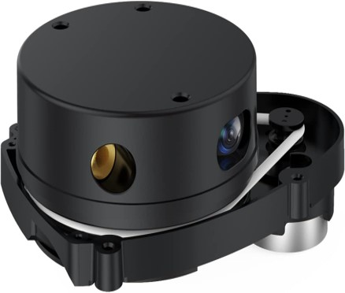

# Semi-Autonomous Electric Wheelchair
**Role:** Lead Software Developer / Embedded Systems Engineer  
---

## Project Overview
Developed an end-to-end autonomy system for a **semi-autonomous electric wheelchair** that combines human joystick control with AI-driven navigation and obstacle avoidance. The system integrates **multimodal sensors** for real-time state estimation, motion planning, and trajectory execution, enabling safe operation in dynamic indoor environments.  

This project bridges human input with intelligent autonomy, demonstrating practical implementation of **AI, controls, and navigation** on embedded robotic platforms.
---

## Key Responsibilities & Achievements
- Built **ROS2-based autonomy software** in **Python/C++** for **NVIDIA Jetson** and **Arduino**, connecting perception, navigation, and control modules.  
- Integrated **LiDAR (2D/3D), IMU, and ultrasonic sensors** using **sensor fusion** and **Kalman filtering** to enhance **localization stability** and **collision prediction**.  
- Implemented **PID control** and closed-loop navigation algorithms to generate **smooth, real-time trajectories**.  
- Developed **end-to-end learning pipelines** for navigation and obstacle avoidance.  
- Conducted **hardware-in-the-loop (HIL) testing** with **PyTest** and **real-time debugging tools** to validate software safety, reliability, and performance on edge devices.  
- Optimized ML and control algorithms for **low-latency execution** on embedded platforms.  
- Documented system architecture, software workflows, and integration protocols for reproducibility and maintainability.  
---

## Technologies & Frameworks
- **Programming Languages:** Python, C++  
- **Embedded Platforms:** NVIDIA Jetson TX2, Arduino, Linux  
- **Frameworks & Tools:** ROS1/ROS2, PyTorch, TensorFlow, Git, PyTest, MATLAB/Simulink  
- **Sensors & Actuators:** 2D/3D LiDAR, IMU, ultrasonic sensors, motors, actuators  
- **Key Concepts:** Navigation, Controls, PID & Optimal Control, Sensor Fusion, Kalman Filtering, Multimodal Perception, End-to-End Learning, Reinforcement Learning Concepts, Edge Compute  

---

## Outcome & Recognition
- Demonstrated **semi-autonomous navigation** with smooth obstacle avoidance and precise trajectory execution.  
- Optimized embedded software to meet **strict real-time performance requirements**.  
- Project recognized with **Best Research Presentation Award** at Widener University’s Undergraduate Research Symposium.  
- Reinforced expertise in **AI-driven robotics, autonomous navigation, sensor fusion, embedded systems, and control algorithms**, directly applicable to real-world robotic applications.  

---

## Visual Representation
## Visualizations

### LiDAR Top View

### Graphic Lidar Data
.png)

### Ultrasonic Sensor

### Trajectory Visualization

## Project Status
This project was completed as part of research work at Widener University. The code is not public due to hardware dependencies.
